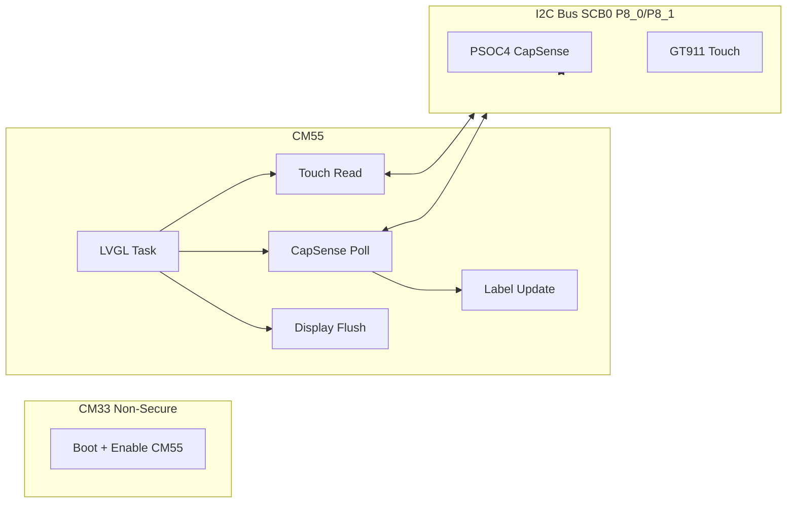

# PSOC&trade; Edge MCU: LVGL + CapSense I2C POC

This project is a POC that renders a simple LVGL UI and updates a label when CapSense events are detected. The UI runs on CM55, and CM55 is the single owner of the shared I2C bus (display/touch + CapSense).

Supported displays:

- Waveshare 4.3-inch Raspberry Pi DSI 800x480 pixel display
- Waveshare 7-inch Raspberry Pi DSI LCD C 1024x600 pixel display
- 10.1 inch 1024x600 TFT display (WF101JTYAHMNB0)

The LCD is connected through the MIPI Display Serial Interface (DSI), and the code is designed to operate in a FreeRTOS environment.

This code example has a three project structure: CM33 secure, CM33 non-secure, and CM55 projects. All three projects are programmed to the external QSPI flash and executed in Execute in Place (XIP) mode. Extended boot launches the CM33 secure project from a fixed location in the external flash, which then configures the protection settings and launches the CM33 non-secure application. Additionally, CM33 non-secure application enables CM55 CPU and launches the CM55 application. The CM55 application implements the logic for this code example.

> **Note:** This application builds for the 7-inch display by default in this POC.

   ```
   CONFIG_DISPLAY=WS7P0DSI_RPI_DISP
   ```

   To build the application for the 7-inch display, set the following macro in *common.mk*:

   ```
   CONFIG_DISPLAY=WS7P0DSI_RPI_DISP
   ```

   OR

   To build the application for the 10.1-inch display, set the following macro in *common.mk*:

   ```
   CONFIG_DISPLAY=WF101JTYAHMNB0_DISP
   ```

## Requirements

- [ModusToolbox&trade;](https://www.infineon.com/modustoolbox) v3.6 or later (tested with v3.6)
- Board support package (BSP) minimum required version: 1.0.0
- Programming language: C
- Associated parts: All [PSOC&trade; Edge MCU](https://www.infineon.com/products/microcontroller/32-bit-psoc-arm-cortex/32-bit-psoc-edge-arm) parts


## Supported toolchains (make variable 'TOOLCHAIN')

- GNU Arm&reg; Embedded Compiler v14.2.1 (`GCC_ARM`) – Default value of `TOOLCHAIN`
- Arm&reg; Compiler v6.22 (`ARM`)
- IAR C/C++ Compiler v9.50.2 (`IAR`)
- LLVM Embedded Toolchain for Arm&reg; v19.1.5 (`LLVM_ARM`)


## Supported kits (make variable 'TARGET')

- [PSOC&trade; Edge E84 Evaluation Kit](https://www.infineon.com/KIT_PSE84_EVAL) (`KIT_PSE84_EVAL_EPC2`) – Default value of `TARGET`
- [PSOC&trade; Edge E84 Evaluation Kit](https://www.infineon.com/KIT_PSE84_EVAL) (`KIT_PSE84_EVAL_EPC4`)
- [PSOC&trade; Edge E84 AI Kit](https://www.infineon.com/KIT_PSE84_AI) (`KIT_PSE84_AI`)


## Hardware setup

This example uses the board's default configuration. See the kit user guide to ensure that the board is configured correctly.

Ensure the following jumper and pin configuration on board.
- BOOT SW must be in the HIGH/ON position
- J20 and J21 must be in the tristate/not connected (NC) position

> **Note:** This hardware setup is not required for KIT_PSE84_AI.

### Supported display and electrical connection

1. **Waveshare 4.3 inch Raspberry Pi DSI 800*480 pixel display:** This display is supported by default <br>

   Connect the FPC 15-pin cable between the display connector and the PSOC&trade; Edge E84 kit's RPi MIPI DSI connector as shown in **Figure 1** <br>

   **Table 1. Cable connection between display connector and kit**

   Kit's name                                      | DSI connector
   ----------------------------------------------- | --------------
   PSOC&trade; Edge E84 Evaluation Kit             | J39
   PSOC&trade; Edge E84 AI Kit                     | J10

   > **Note:** The PSOC&trade; Edge E84 AI kit supports Waveshare 4.3 inch Raspberry Pi DSI 800*480 pixel display.

   **Figure 1.  Display connection with PSOC&trade; Edge E84 evaluation kit**

   

2. **Waveshare 7-inch Raspberry-Pi DSI LCD C 1024*600 pixel display:** <br>

   In this display, few I2C connections are present on the header named `FAN` on display's hardware, it is highlighted in **Figure 2** <br>

   **Figure 2. Waveshare 7-inch Raspberry Pi DSI LCD (C) display's I2C connection (FAN connector)**

   

   Interface the display with the PSOC&trade; Edge E84 Evaluation Kit using the connections outlined in **Table 2** <br>

   **Table 2: PSOC&trade; Edge E84 Evaluation Kit connections**

   Display's Connector | PSOC&trade; Edge E84 Evaluation Kit's connector
   --------------------|----------------------------------------
   DSI connector       | J39
   GND (FAN)           | GND (J41)
   5V  (FAN)           | 5V (J41)
   SCL (FAN)           | I2C_SCL (J41)
   SDA (FAN)           | I2C_SDA (J41)

<br>

3. **10.1 inch 1024*600 pixel TFT LCD (WF101JTYAHMNB0):** This setup requires rework on the PSOC&trade; Edge E84 evaluation kit, and the rework instructions are as follows:

   - **Remove:** R22, R23, R24, R25, R26, R27
   - **Populate:** R28, R29, R30, R31, R32, R33

   **Figure 3. Rework on PSOC™ Edge E84 baseboard**

   

   Interface the display with the PSOC&trade; Edge E84 Evaluation Kit using the connections outlined in **Table 3** <br>

   **Table 3: PSOC&trade; Edge E84 Evaluation Kit connections**

   Display's Connector | PSOC&trade; Edge E84 Evaluation Kit's connector
   --------------------|----------------------------------------
   DSI connector       | J38
   Touch connector     | J37

<br>

## Software setup

See the [ModusToolbox&trade; tools package installation guide](https://www.infineon.com/ModusToolboxInstallguide) for information about installing and configuring the tools package.

Install a terminal emulator if you do not have one. Instructions in this document use [Tera Term](https://teratermproject.github.io/index-en.html).

This example requires no additional software or tools.


## POC behavior

- CM55 runs LVGL and polls CapSense over the same I2C bus used by display/touch.
- When a CapSense button/slider event occurs, the UI label updates (e.g., `CAPSENSE: BTN0`, `CAPSENSE: SLIDER=...`).
- CM33 remains in its default role (boot + enable CM55).

## Architecture (Mermaid)



## Operation

See [Using the code example](docs/using_the_code_example.md) for instructions on creating a project, opening it in various supported IDEs, and performing tasks, such as building, programming, and debugging the application within the respective IDEs.

1. Connect the selected LCD display to the board according to the instructions given in [Display setup](#supported-display-and-electrical-connection-with-kit_pse84_eval) section

2. Connect the board to your PC using the provided USB cable through the KitProg3 USB connector

3. Open a terminal program and select the KitProg3 COM port. Set the serial port parameters to 8N1 and 115200 baud

4. In the common makefile - _<application\>/common.mk_, add one of the following set of values in the **variable** `CONFIG_DISPLAY` to enable display and its corresponding touch driver compilation for the selected display panel. The same information is mentioned in comments in the common makefile

   - **Waveshare 4.3-inch Raspberry-Pi DSI LCD and it's touch panel (FT5406):** `W4P3INCH_DISP` <br> This is enabled by default

   - **Waveshare 7 inch Raspberry Pi DSI LCD (C) Display (DISP_WS7P0DSI_RPI) and it's touch panel (GT911):** `WS7P0DSI_RPI_DISP`

   - **10.1 inch 1024*600 TFT LCD (WF101JTYAHMNB0) and it's touch panel (ILI2511):** `WF101JTYAHMNB0_DISP`

      > **Note:** From the above set, at a time only one display with its touch driver will be enabled in the _common makefile_.

      **Example**:

      To use the Waveshare 7-inch Raspberry Pi DSI LCD (C) display:

      ```
      CONFIG_DISPLAY = WS7P0DSI_RPI_DISP
      ```

      OR

      To use the 10.1 inch WF101JTYAHMNB0 display:

      ```
      CONFIG_DISPLAY = WF101JTYAHMNB0_DISP
      ```

5. Program the PSOC4 CapSense device using the `psoc4-csd-button-slider.cyacd2` file from the CapSense example.

6. Build and program the application

7. After programming, the application starts automatically. Confirm that "PSOC Edge MCU: Graphics LVGL Demo" is displayed on the UART terminal (UART banner text is unchanged from the base example)

   **Figure 4. Terminal output on program startup**

   

8. Observe that the LCD shows a simple label that updates when CapSense button/slider events occur.

9. For testing the code example with the other supported display, repeat the above steps. At **Step 4**, enable the display of your choice and then follow the rest of the steps

