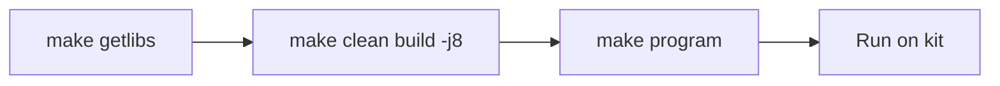

# Build Setup – Make and Toolchain

This document walks you through setting up the build environment, configuring toolchains, and running build commands across different shells (Git Bash and PowerShell).

### Build and program flow



---

## Step 1: Toolchain Requirements

| Project | Default Toolchain | Requirement |
| :--- | :--- | :--- |
| **proj_cm33_s** | GCC_ARM | Included with ModusToolbox. |
| **proj_cm33_ns** | GCC_ARM | Included with ModusToolbox. |
| **proj_cm55** | LLVM_ARM | **Requires manual installation.** Set `CY_COMPILER_LLVM_ARM_DIR`. |

---

## Step 2: Environment Setup (Permanent)

### 2.1. Add `make` to Git Bash
If `make: command not found` appears in Git Bash, add the ModusToolbox shell tools to your path:

1. Open `~/.bashrc`:
   ```bash
   notepad ~/.bashrc
   ```
2. Add the following line (adjust path for your version):
   ```bash
   export PATH="/c/Users/drsanti/ModusToolbox/tools_3.6/modus-shell/bin:$PATH"
   ```
3. Reload: `source ~/.bashrc`

### 2.2. Configure LLVM Path
The project needs to know where the LLVM toolchain is installed for the CM55 core.

**Option A: Edit proj_cm55/Makefile (Recommended)**
Add this line after `TOOLCHAIN=LLVM_ARM`:
```makefile
CY_COMPILER_LLVM_ARM_DIR ?= d:/dev/LLVM/LLVM-ET-Arm-19.1.5-Windows-x86_64
```

**Option B: Windows Environment Variable**
Set a User Environment Variable:
- **Name**: `CY_COMPILER_LLVM_ARM_DIR`
- **Value**: `d:\dev\LLVM\LLVM-ET-Arm-19.1.5-Windows-x86_64`

---

## Step 3: Fast Build & Program (Per-Session)

If you haven't set permanent variables, or if you are an AI agent working in a transient shell, use these one-line commands:

### Using Git Bash (User)
```bash
export PATH="/c/Users/drsanti/ModusToolbox/tools_3.6/modus-shell/bin:$PATH"; \
export CY_COMPILER_LLVM_ARM_DIR="/d/dev/LLVM/LLVM-ET-Arm-19.1.5-Windows-x86_64"; \
make program -j8
```

### Using PowerShell (AI Agent / Windows Terminal)
```powershell
$env:PATH = "C:\Users\drsanti\ModusToolbox\tools_3.6\modus-shell\bin;" + $env:PATH; \
$env:CY_COMPILER_LLVM_ARM_DIR = "d:/dev/LLVM/LLVM-ET-Arm-19.1.5-Windows-x86_64"; \
make program -j8
```

---

## Step 4: Verification
After running the program command, verify the following output at the end of the log:
```text
wrote 1851392 bytes from file .../app_combined.hex in X.Xs
verified 1846592 bytes in X.Xs
Exit code: 0
```

---

## Troubleshooting

### `make: command not found`
- **Git Bash**: Ensure Step 2.1 is completed.
- **PowerShell**: The ModusToolbox shell tools must be added to `$env:PATH`.

### `Cannot find LLVM_ARM toolchain`
- Ensure `CY_COMPILER_LLVM_ARM_DIR` points to the folder **containing** the `bin` directory, not the `bin` directory itself.
- Ensure forward slashes are used in Makefiles (`/`), while backslashes are okay for Windows environment variables (`\`).

### Build works in Git Bash but not in VS Code Task
- VS Code tasks often run in a different shell session. Use **Option A (Makefile)** in Step 2.2 for consistent results across all environments.
