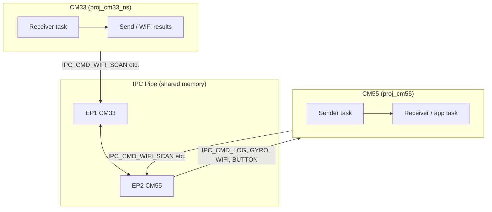
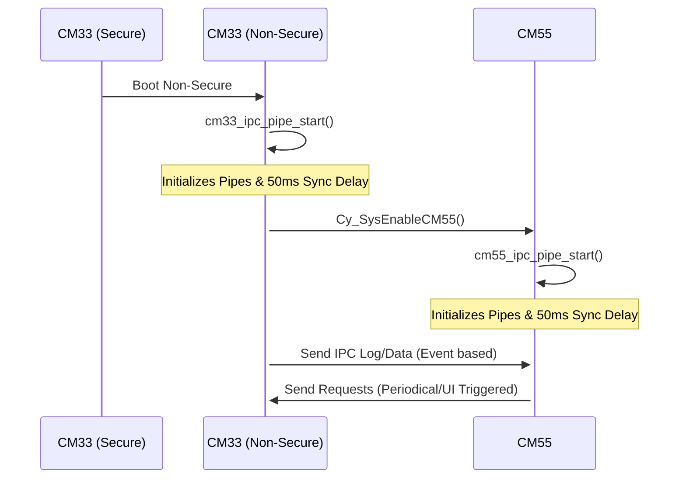
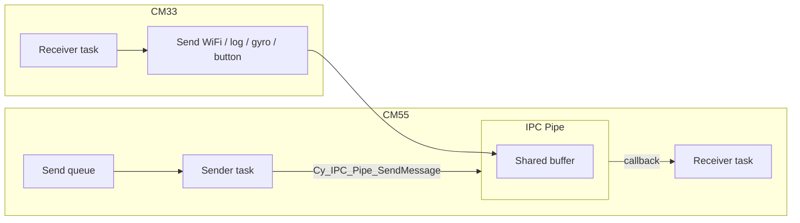

# IPC (Inter-Processor Communication)

This document describes the IPC mechanism implemented between the **Cortex-M33** and **Cortex-M55** cores in the PSOC™ Edge MCU.

## Overview

The IPC (Inter-Processor Communication) in this project uses the Infineon **IPC Pipe** driver to exchange messages between the cores. Each core runs independently, with the CM33 handling lower-level tasks and connectivity, while the CM55 handles the high-performance UI (LVGL) and data display formatting.

### Multi-Core Roles

| Core | Role | IPC Responsibility |
|------|------|-------------------|
| **CM33** | System Control & Connectivity | Handles Wi-Fi hardware interactions. Sends Wi-Fi scan results and sensor data to CM55. Performs filtering on Wi-Fi scans. |
| **CM55** | UI & Graphics (LVGL) & Logging | Requests Wi-Fi scans (Global, RSSI-specific, Filtered). **Processes and formats scan results for console output.** Displays data on the UI (LVGL). Processes gyro data and button events. |

### Block diagram



---

## Hardware Configuration

The communication is built on top of the hardware IPC physical channels. The configuration is defined in `shared/include/ipc_communication.h`.

- **IPC Channel 4 (EP1)**: Allocated for CM33 non-secure processor (`CM33_IPC_PIPE_EP_ADDR = 1UL`).
- **IPC Channel 15 (EP2)**: Allocated for CM55 processor (`CM55_IPC_PIPE_EP_ADDR = 2UL`).
- **Client IDs**:
  - CM33 Client ID: `3UL`
  - CM55 Client ID: `5UL`
- **Shared Memory**: A region in SRAM is marked as `CY_SECTION_SHAREDMEM` for the message structures (`ipc_msg_t`).

---

## Data Structures

The IPC messages are exchanged using a standard structure that includes a client ID, interrupt mask, command, and data payload.

```c
#define IPC_DATA_MAX_LEN (128UL)

typedef struct {
  uint16_t client_id; /* Bits 0-7: Client ID */
  uint16_t intr_mask; /* Bits 16-31: Release Mask (MANDATORY for Pipe Driver) */
  uint32_t cmd;
  uint32_t value;
  char data[IPC_DATA_MAX_LEN];
} ipc_msg_t;
```

### IPC Commands

| Command Hex | Macro | Source -> Dest | Payload |
| :--- | :--- | :--- | :--- |
| `0x90` | `IPC_CMD_LOG` | CM33 -> CM55 | `char[]` (log string) |
| `0x91` | `IPC_CMD_WIFI_STATUS` | CM33 -> CM55 | `wifi_info_t` (one per network) |
| `0x92` | `IPC_CMD_GYRO` | CM33 -> CM55 | `gyro_data_t` |
| `0x93` | `IPC_CMD_WIFI_SCAN_LIST` | CM55 -> CM33 | `NULL` (request global scan) |
| `0x94` | `IPC_CMD_WIFI_RSSI_REQ` | CM55 -> CM33 | `wifi_scan_request_t` (SSID) |
| `0x95` | `IPC_CMD_WIFI_RSSI_RESP` | CM33 -> CM55 | `wifi_status_t` |
| `0x96` | `IPC_CMD_WIFI_FILTER_SCAN_REQ` | CM55 -> CM33 | `wifi_scan_request_t` |
| `0x97` | `IPC_CMD_WIFI_FILTER_SCAN_RESP` | CM33 -> CM55 | `wifi_filter_result_t` |
| `0x98` | `IPC_CMD_BUTTON_EVENT` | CM33 -> CM55 | `button_event_t` (see `ipc_data_model.h`) |
| `0x99` | `IPC_CMD_WIFI_SET_FILTER`| CM55 -> CM33 | `value = wifi_filter_mode_t` |
| `0x9A` | `IPC_CMD_WIFI_SCAN_SUMMARY`| CM33 -> CM55 | `wifi_scan_summary_t` |

---

## Initialization Flow

The CM33 core boots first and is responsible for enabling the CM55 core. The IPC pipes must be initialized on both sides, with a small synchronization delay.



---

## Communication Logic



### CM33 Side (Source: `proj_cm33_ns/cm33_ipc_pipe.c`)
- **`cm33_ipc_receiver_task`**:
  - Monitors received requests from CM55.
  - Handles `IPC_CMD_WIFI_SCAN_LIST` to trigger `wifi_scan_manager_request_scan()`.
  - Handles `IPC_CMD_WIFI_RSSI_REQ` / `IPC_CMD_WIFI_FILTER_SCAN_REQ`.
  - Handles `IPC_CMD_WIFI_SET_FILTER` to change active scan filters.
- **`cm33_ipc_send_wifi_results`**:
  - Iterates through scan results.
  - Packs `total_count` and `current_index` into the `value` field using `IPC_VALUE_COUNT_SHIFT`.
  - **Implemented a 5ms delay** between segments to prevent static buffer overwrite on the receiver side.

### CM55 Side (Source: `proj_cm55/src/cm55_ipc_pipe.c`)
- **`cm55_ipc_sender_task`**:
  - Waits for messages in `s_ipc_send_queue`.
  - Atomically sends messages to CM33 using `Cy_IPC_Pipe_SendMessage`.
  - **Implements 100ms throttling** to prevent overwhelming the CM33 and the IPC hardware buffer.
- **`cm55_ipc_receiver_task`**:
  - Parses incoming `wifi_info_t` segments and gyro data.
  - Accumulates Wi-Fi segments and sets `s_wifi_list_ready`.
  - **Maintains `s_wifi_list_valid`** for persistent UI data access.
  - **Processes `IPC_CMD_WIFI_RSSI_RESP`** for real-time signal monitoring, separate from the full scan list.

---

## Error Handling & Robustness

1.  **Synchronization Delay**: Both cores implement a 50ms `Cy_SysLib_Delay` during initialization.
2.  **Sender-Consumer Throttling**: The CM33 uses `vTaskDelay(pdMS_TO_TICKS(5))` when sending multi-packet Wi-Fi lists. This ensures the CM55 task has time to copy the data from the shared memory buffer before it is overwritten by the next packet.
3.  **Command Decoupling**: The CM55 receiver task checks specific "Ready" flags rather than just the last command ID, ensuring that transient messages (like Gyro) don't cause the task to skip processing valid Wi-Fi or Event data.
4.  **Shared Memory Security**: Message structures are placed in `CY_SECTION_SHAREDMEM` to ensure visibility across both cores.

---

## Key Files

- `shared/include/ipc_communication.h`: Shared definitions, struct `ipc_msg_t`, and `wifi_info_t`.
- `proj_cm33_ns/cm33_ipc_pipe.c`: CM33 message management and throttling.
- `proj_cm55/src/cm55_ipc_pipe.c`: CM55 result accumulation and display formatting.
- `proj_cm55/src/main.c`: CM55 main; initializes the listener tasks.

---
*Last updated: 2026-02-08*
