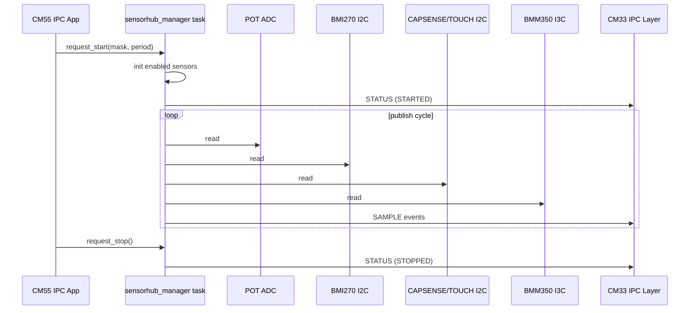

# SensorHub Manager Module - User Manual

**Author:** Asst. Prof. Santi Nuratch, Ph.D  
**Organization:** Thailand Embedded Systems Association (TESA)  
**Target:** PSoC Edge E84, CM33 (non-secure)

---

## 1. Overview

The `sensorhub_manager` module runs on CM33 and aggregates sensor data from multiple sources into one event-driven interface for IPC transport to CM55 UI.

Current integrated sensors:

- POT (AutAnalog ADC)
- BMI270 (I2C)
- CAPSENSE (I2C)
- TOUCH (I2C)
- BMM350 (I3C)

The module owns one manager task + command queue and publishes:

- `SENSORHUB_MANAGER_EVENT_STATUS` (`ipc_sensorhub_status_t`)
- `SENSORHUB_MANAGER_EVENT_SAMPLE` (`ipc_sensorhub_sample_t`)

---

## 2. Features

- Unified start/stop/status control via FreeRTOS queue.
- Configurable sensor mask and sampling period (`ipc_sensorhub_start_request_t`).
- Runtime fallback per sensor (disable only failed sensor, keep others running).
- BMI270 warm-up / retry / re-init / stuck-zero handling.
- CAPSENSE + TOUCH heartbeat/update filtering.
- BMM350 over I3C (using `mtb_bmm350`).

### Sampling Period Limits

Sampling period is clamped in `sensorhub_manager.c`:

- `SENSORHUB_MANAGER_MIN_PERIOD_MS = 100` (max data update rate `10 Hz`)
- `SENSORHUB_MANAGER_MAX_PERIOD_MS = 5000`

If CM55 requests a period outside this range, CM33 clamps it before running.

---

## 3. Dependencies

- FreeRTOS (`queue`, `task`)
- IPC types: `shared/include/ipc_communication.h`
- BSP generated configs: `cycfg_peripherals.h`
- Drivers/libraries:
  - `mtb_bmi270`
  - `mtb_bmm350` (`COMPONENT_BMM350_I3C`)
  - `mtb_hal_i2c`
  - `cy_autanalog`
  - `cy_pdl` (I3C/SYSINT)

---

## 4. Integration

### 4.1 Makefile

Module location:

- `proj_cm33_ns/modules/sensorhub_manager/`

Add to `proj_cm33_ns/Makefile`:

```makefile
SOURCES+= modules/sensorhub_manager/sensorhub_manager.c
INCLUDES+= modules/sensorhub_manager
COMPONENTS+= BMM350_I3C
```

### 4.2 Initialization order


---

## 5. Runtime Architecture



---

## 6. Public API

Declared in `sensorhub_manager.h`:

- `bool sensorhub_manager_init(void);`
- `bool sensorhub_manager_start(void);`
- `bool sensorhub_manager_set_event_callback(sensorhub_manager_event_cb_t callback, void *user_data);`
- `bool sensorhub_manager_request_start(const ipc_sensorhub_start_request_t *request);`
- `bool sensorhub_manager_request_stop(void);`
- `bool sensorhub_manager_request_status(void);`

Event callback:

```c
typedef void (*sensorhub_manager_event_cb_t)(sensorhub_manager_event_t event,
                                             const void *data,
                                             uint32_t count,
                                             void *user_data);
```

---

## 7. Event Data Mapping

- `SENSORHUB_MANAGER_EVENT_STATUS`
  - `data`: `ipc_sensorhub_status_t`
  - `count`: `1`
- `SENSORHUB_MANAGER_EVENT_SAMPLE`
  - `data`: `ipc_sensorhub_sample_t`
  - `count`: `1`

Sample type is selected by `sample.sensor_type`:

- `IPC_SENSORHUB_SENSOR_POT`
- `IPC_SENSORHUB_SENSOR_BMI270`
- `IPC_SENSORHUB_SENSOR_CAPSENSE`
- `IPC_SENSORHUB_SENSOR_TOUCH`
- `IPC_SENSORHUB_SENSOR_BMM350`

---

## 8. Failure Behavior

- If a sensor repeatedly fails, only that sensor mask bit is cleared.
- Manager continues running while at least one sensor remains enabled.
- Status reason uses `IPC_SENSORHUB_REASON_ERROR` for degraded operation.

---

## 9. Files

- `sensorhub_manager.h` - Public API
- `sensorhub_manager.c` - Implementation
- `SENSORHUB_MANAGER.md` - This document
