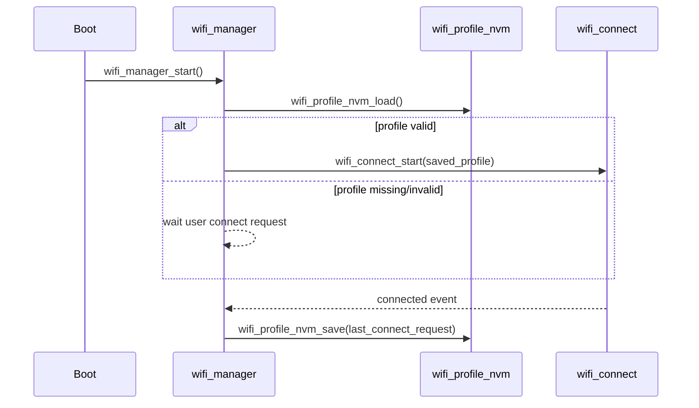

# Wi-Fi Profile NVM Module - User Manual

**Author:** Asst. Prof. Santi Nuratch, Ph.D  
**Organization:** Thailand Embedded Systems Association (TESA)  
**Target:** PSoC Edge E84, CM33 (non-secure)

---

## 1. Overview

The `wifi_profile_nvm` module persists one Wi-Fi profile (SSID, password, security) in CM33 user NVM (`user_nvm` RRAM region).  
It provides a minimal API to load, save, and clear the profile and is designed to be used by `wifi_manager` for:

- Auto-connect after boot (load profile).
- Save-on-success after Wi-Fi connects.
- Manual profile clear from UI/IPC command.

---

## 2. Features

- **Single-profile persistence** - Stores exactly one Wi-Fi connect profile.
- **Integrity check** - Uses CRC32 over `ssid`, `password`, and `security`.
- **Header validation** - Verifies magic/version/valid/payload length before accepting data.
- **Primary + legacy read path** - Reads from primary slot first, then falls back to legacy slot.
- **Write verification** - Read-back compare after write to ensure data was stored correctly.
- **Safe clear** - Clears both primary and legacy slots with `0xFF`.

---

## 3. Dependencies

- `cy_pdl.h`, `cybsp.h` - Device memory symbols and RRAM APIs.
- RRAM driver APIs:
  - `Cy_RRAM_TSReadByteArray`
  - `Cy_RRAM_NvmWriteByteArray`
- IPC Wi-Fi type:
  - `ipc_wifi_connect_request_t` from `ipc_communication.h`

---

## 4. Memory Layout

The module uses fixed-size slots inside `user_nvm`.

- `WIFI_PROFILE_NVM_SLOT_SIZE = 256` bytes
- **Primary slot**: end of `user_nvm`
- **Legacy slot**: start of `user_nvm` (read fallback / clear compatibility)


---

## 5. Record Format

The stored record (`wifi_profile_record_t`) contains:

- `magic` (`WFP1`)
- `version`
- `payload_len`
- `crc32`
- `valid`
- `ssid`
- `password`
- `security`

CRC32 is calculated from:

1. `ssid` buffer bytes
2. `password` buffer bytes
3. `security` bytes

This avoids struct padding sensitivity across builds/toolchains.

---

## 6. Integration

### 6.1 Makefile

Add the module to CM33 NS project:

```makefile
SOURCES+= modules/wifi_profile_nvm/wifi_profile_nvm.c
INCLUDES+= modules/wifi_profile_nvm
```

### 6.2 Typical usage with wifi_manager



---

## 7. API Reference

### 7.1 `wifi_profile_nvm_load`

```c
bool wifi_profile_nvm_load(ipc_wifi_connect_request_t *out_profile);
```

- Returns `true` when a valid profile is found and copied to `out_profile`.
- Checks primary slot first, then legacy slot.
- Returns `false` if empty, invalid, CRC mismatch, or read error.

### 7.2 `wifi_profile_nvm_save`

```c
bool wifi_profile_nvm_save(const ipc_wifi_connect_request_t *profile);
```

- Encodes and writes profile to primary slot.
- Performs read-back verification.
- Returns `false` on write/read/verify failure.

### 7.3 `wifi_profile_nvm_clear`

```c
bool wifi_profile_nvm_clear(void);
```

- Writes `0xFF` to primary slot.
- Also clears legacy slot for compatibility cleanup.

---

## 8. Usage Examples

**Load on startup:**

```c
ipc_wifi_connect_request_t profile;
if (wifi_profile_nvm_load(&profile))
{
    wifi_manager_request_connect(&profile);
}
```

**Save after successful connect:**

```c
ipc_wifi_connect_request_t req = {0};
strncpy(req.ssid, "MyAP", sizeof(req.ssid) - 1);
strncpy(req.password, "MyPassword", sizeof(req.password) - 1);
req.security = CY_WCM_SECURITY_WPA2_AES_PSK;
(void)wifi_profile_nvm_save(&req);
```

**Clear profile:**

```c
(void)wifi_profile_nvm_clear();
```

---

## 9. Limits and Notes

- Stores only one profile.
- Profile is saved by policy in `wifi_manager` (current design: save on successful connect).
- If profile header or CRC is invalid, load is rejected.
- Diagnostic logs use `[CM33][NVM] ...`.
- Module is CM33-side only; CM55 accesses it indirectly through IPC commands handled by `wifi_manager`.

---

## 10. Files

- `wifi_profile_nvm.h` - Public API
- `wifi_profile_nvm.c` - Implementation
- `WIFI_PROFILE_NVM.md` - This document

