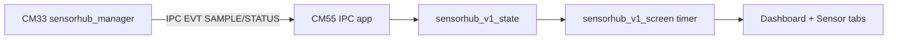

# SensorHub V1 UI - User Manual

**Target:** CM55 + LVGL (`proj_cm55/src/ui/sensorhub_v1`)

---

## 1. Overview

`sensorhub_v1` is the CM55 UI for SensorHub IPC data from CM33.

Current UX structure:

- **Header:** state summary + mode/navigation hint
- **Dashboard tab:** text summary of all sensors + IPC debug log
- **POT tab:** donut gauge + numeric details
- **BMI270 tab:** value panel + trend chart
- **CAPSENSE tab:** BTN0/BTN1 states + slider indicator
- **BMM350 tab:** compass needle + heading + magnetic field values

This keeps debug visibility in one place (Dashboard) and gives each sensor a larger focused UI area.

---

## 2. Directory Structure

```text
sensorhub_v1/
  sensorhub_v1_screen.c/.h
  sensorhub_v1_state.c/.h
  sensorhub_v1_types.h
  components/
    dashboard/
    pot/
    bmi270/
    capsense_touch/
    bmm350/
```

- `sensorhub_v1_screen.*` - Top-level layout, tabs, periodic refresh timer, status row
- `sensorhub_v1_state.*` - Snapshot polling + request bridge to `cm55_ipc_app`
- `components/*` - Per-sensor/per-tab rendering components
  - Note: folder name `capsense_touch/` is retained for compatibility, but current tab content is CAPSENSE-only.

---

## 3. Data Flow



---

## 4. Runtime Behavior

- Default mode is **auto-start** (`SENSORHUB_V1_AUTO_START_ON_CREATE = 1`).
- Default mode is **display-only** (`SENSORHUB_V1_DISPLAY_ONLY_MODE = 1`).
- Hardware buttons navigation: `BUTTON_0` = previous tab, `BUTTON_1` = next tab.
- Display-touch interaction is intentionally not required for navigation/control in this mode.
- Button navigation uses release-based handling (press-down arms, release triggers one step) with debounce interval to reduce switch bounce effects.
- Sensor enable/disable state is read from mask in status event.
- BMM heading uses compass convention (`0deg = North`, clockwise).

---

## 5. Configuration Macros (`sensorhub_v1_screen.c`)

- `SENSORHUB_V1_REFRESH_MS` - UI refresh period (current: `33 ms`, ~`30.3 FPS`).
- `SENSORHUB_V1_DEFAULT_PERIOD_MS` - SensorHub sampling period requested at start (current: `120 ms`, ~`8.3 Hz`).
- `SENSORHUB_V1_DEFAULT_MASK` - Sensor set requested by auto-start.
- `SENSORHUB_V1_AUTO_START_ON_CREATE` - Auto start on screen create.
- `SENSORHUB_V1_DISPLAY_ONLY_MODE` - Hide Start/Stop and run as monitor UI.
- `SENSORHUB_V1_BUTTON_TAB_NAV_ENABLE` - Enable tab navigation by on-board buttons.
- `SENSORHUB_V1_BUTTON_NAV_MIN_INTERVAL_MS` - Minimum interval between tab-switch actions from board buttons.

---

## 6. Rate Tuning Guide

Use these formulas:

- `UI refresh rate (FPS) = 1000 / SENSORHUB_V1_REFRESH_MS`
- `Data update rate (Hz) = 1000 / SENSORHUB_V1_DEFAULT_PERIOD_MS`

Example with current values:

- `SENSORHUB_V1_REFRESH_MS = 33` -> `~30.3 FPS`
- `SENSORHUB_V1_DEFAULT_PERIOD_MS = 120` -> `~8.3 Hz`

Where to tune:

- CM55 UI rate: `proj_cm55/src/ui/sensorhub_v1/sensorhub_v1_screen.c`
  - `SENSORHUB_V1_REFRESH_MS`
  - `SENSORHUB_V1_DEFAULT_PERIOD_MS` (request sent to CM33 on start)
- CM33 data-period clamp: `proj_cm33_ns/modules/sensorhub_manager/sensorhub_manager.c`
  - `SENSORHUB_MANAGER_MIN_PERIOD_MS`
  - `SENSORHUB_MANAGER_MAX_PERIOD_MS`

Important note:

- Even if CM55 requests a smaller period, CM33 clamps by `SENSORHUB_MANAGER_MIN_PERIOD_MS` (currently `100 ms`, max `10 Hz`).
