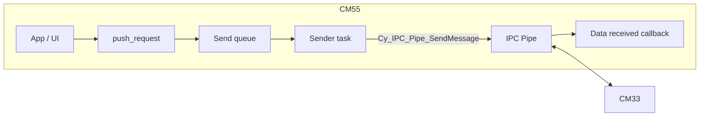
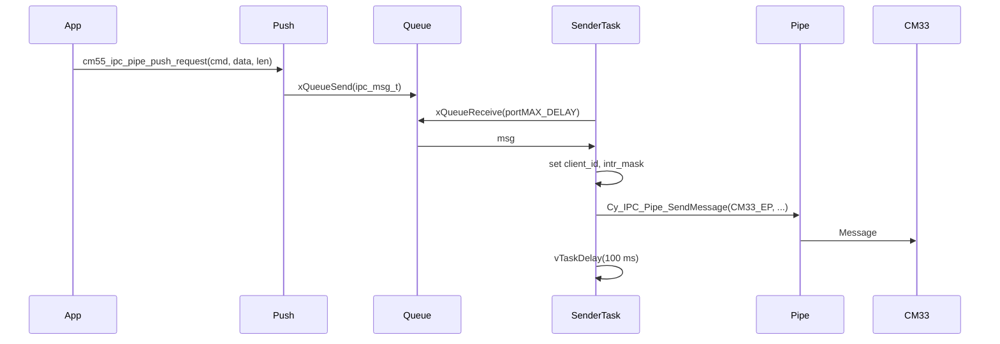

# CM55 IPC Pipe Module – User Manual

**Author:** Asst. Prof. Santi Nuratch, Ph.D  
**Organization:** Thailand Embedded Systems Association (TESA)

---

## 1. Overview

The CM55 IPC pipe module runs on the CM55 core and provides the transport layer for IPC communication with CM33. It maintains a send queue and a FreeRTOS sender task that dequeues requests and sends them over the Infineon IPC pipe to CM33. Received messages are delivered to a raw data callback (e.g. the CM55 IPC app layer registers this callback and parses commands). The module does not interpret message content; it only sends and receives opaque `ipc_msg_t` payloads.

---

## 2. Features

- **Send queue** – Outgoing requests (cmd + optional data) are queued; a dedicated sender task sends them to CM33 with a fixed 100 ms delay between messages.
- **Raw receive callback** – When CM33 sends data, the pipe invokes `cm55_ipc_data_received_cb_t` with a pointer to the IPC message buffer; the consumer parses `ipc_msg_t` (cmd, value, data).
- **Configurable** – Task stack, priority, queue length, and startup delay (ms after pipe setup, before callback registration) are configurable via `cm55_ipc_pipe_config_t` or `CM55_GET_CONFIG_DEFAULT()`.
- **Startup delay** – Optional delay after `cm55_ipc_communication_setup()` and before registering the callback so CM33 and IPC hardware can settle.
- **Failure handling** – `cm55_ipc_pipe_start()` returns false on failure; caller must treat as error and disable interrupts. On failure the implementation may call `cm55_handle_error()`.

---

## 3. Dependencies

- **FreeRTOS** – Queue and task for the sender.
- **ipc_communication.h** – `ipc_msg_t`, `IPC_DATA_MAX_LEN`, pipe client/endpoint addresses, `cm55_ipc_communication_setup()`.
- **BSP / PDL** – `Cy_IPC_Pipe_*` and `Cy_SysLib_Delay` (Infineon middleware).
- **error_handler** – `cm55_handle_error()` on start failure (optional dependency).

---

## 4. Architecture

Outgoing path: application calls `cm55_ipc_pipe_push_request(cmd, data, data_len)` → message is copied into the send queue → sender task receives from queue, sets `client_id` and `intr_mask`, calls `Cy_IPC_Pipe_SendMessage()` to CM33, then delays 100 ms. Incoming path: CM33 writes to the IPC pipe → hardware invokes the registered callback with `msg_data` (pointer to `ipc_msg_t`) → consumer parses cmd/value/data (typically the CM55 IPC app module).





---

## 5. Integration

### 5.1 Makefile

The module lives in the CM55 project tree: `proj_cm55/modules/cm55_ipc_pipe/` (header and source). The CM55 Makefile already includes it:

```makefile
SOURCES += modules/cm55_ipc_pipe/cm55_ipc_pipe.c
INCLUDES += modules/cm55_ipc_pipe
```

Ensure `ipc_communication.h` and the shared CM55 IPC communication source (e.g. `shared/source/COMPONENT_CM55/cm55_ipc_communication.c`) are built and on the include path so that `cm55_ipc_communication_setup()` is available.

### 5.2 Initialization (typical use via CM55 IPC app)

The pipe is usually started by the **CM55 IPC app** module in `cm55_ipc_app_init()`, which calls `cm55_ipc_pipe_init(&CM55_GET_CONFIG_DEFAULT())` then `cm55_ipc_pipe_start(cb)`. If you use the pipe without the app layer:

1. Optionally call `cm55_ipc_pipe_init(config)` with a custom config or omit to use defaults.
2. Optionally call `cm55_ipc_pipe_set_data_received_callback(cb)` to set the receive callback.
3. Call `cm55_ipc_pipe_start(cb)` with your data-received callback (or NULL to use the set callback or a no-op). On failure, treat as error and disable interrupts.

Example (standalone pipe, no app):

```c
#include "cm55_ipc_pipe.h"

static void my_ipc_cb(uint32_t *msg_data) {
  ipc_msg_t *msg = (ipc_msg_t *)msg_data;
  (void)msg;
}

void app_start_ipc(void) {
  cm55_ipc_pipe_init(&CM55_GET_CONFIG_DEFAULT());
  if (!cm55_ipc_pipe_start(my_ipc_cb)) {
    /* handle error, disable interrupts */
  }
}
```

### 5.3 Init order

- `cm55_ipc_pipe_init()` must be called before `cm55_ipc_pipe_start()` if you want non-default config.
- `cm55_ipc_pipe_start()` creates the queue, runs `cm55_ipc_communication_setup()`, waits `startup_delay_ms`, registers the pipe callback, then creates the sender task. Call it once; on failure the queue/callback/task are not left half-initialized (queue is deleted on register or task failure).

---

## 6. API Reference

### 6.1 Lifecycle

| Function | Description |
|----------|-------------|
| `cm55_ipc_pipe_init(config)` | Applies pipe configuration (task stack, prio, queue length, startup delay). config NULL leaves defaults unchanged. |
| `cm55_ipc_pipe_set_data_received_callback(cb)` | Sets the callback used when pipe is started without a callback argument. NULL allowed. |
| `cm55_ipc_pipe_start(cb)` | Creates send queue, runs communication setup, waits startup_delay_ms, registers pipe callback, creates sender task. cb NULL uses set callback or no-op. Returns false on queue or register or task create failure; caller must treat as error and disable interrupts. |

### 6.2 Send

| Function | Description |
|----------|-------------|
| `cm55_ipc_pipe_push_request(cmd, data, data_len)` | Enqueues an IPC request. cmd from ipc_communication.h; data may be NULL when data_len 0; data_len capped to IPC_DATA_MAX_LEN. Returns false if queue full or not initialized. |

---

## 7. Types

### 7.1 cm55_ipc_pipe_config_t

| Field | Type | Description |
|-------|------|-------------|
| task_stack | uint32_t | Stack size in words for the IPC pipe FreeRTOS task. |
| task_prio | uint32_t | FreeRTOS priority of the pipe task. |
| send_queue_len | uint32_t | Length of the send queue (outgoing requests to CM33). |
| startup_delay_ms | uint32_t | Startup delay in ms after pipe setup, before registering callback (lets CM33/IPC settle). |

### 7.2 cm55_ipc_data_received_cb_t

Callback invoked when raw IPC message data is received; msg_data points to the IPC buffer (ipc_msg_t):

```c
typedef void (*cm55_ipc_data_received_cb_t)(uint32_t *msg_data);
```

### 7.3 Macros (defaults)

| Macro | Value | Description |
|-------|--------|-------------|
| CM55_IPC_PIPE_WIFI_LIST_MAX | 32U | Max number of Wi-Fi entries in a scan list (used by app layer). |
| CM55_IPC_PIPE_VALUE_INDEX_MASK | 0xFFFFU | Mask for lower 16 bits of packed value (index) or count after shift. |
| CM55_IPC_PIPE_VALUE_COUNT_SHIFT | 16U | Shift to get total count from upper 16 bits of packed value. |
| CM55_IPC_PIPE_TASK_STACK_DEFAULT | 1024U | Default stack size in words for the pipe task. |
| CM55_IPC_PIPE_TASK_PRIO_DEFAULT | 2U | Default FreeRTOS priority for the pipe task. |
| CM55_IPC_PIPE_SEND_QUEUE_LEN_DEFAULT | 10U | Default length of the send queue. |
| CM55_IPC_PIPE_STARTUP_DELAY_MS_DEFAULT | 50U | Default ms delay after pipe setup, before callback registration. |

---

## 8. Usage Examples

**Default config and start with callback:**

```c
cm55_ipc_pipe_init(&CM55_GET_CONFIG_DEFAULT());
if (!cm55_ipc_pipe_start(my_data_received_cb)) {
  /* error */
}
```

**Custom config:**

```c
cm55_ipc_pipe_config_t config = {
  .task_stack      = 1024U,
  .task_prio       = 2U,
  .send_queue_len  = 16U,
  .startup_delay_ms = 100U,
};
cm55_ipc_pipe_init(&config);
cm55_ipc_pipe_start(my_cb);
```

**Push a request (e.g. Wi-Fi scan):**

```c
wifi_filter_config_t filter = { .mode = WIFI_FILTER_MODE_NONE };
(void)cm55_ipc_pipe_push_request(IPC_CMD_WIFI_SCAN, &filter, sizeof(filter));
```

---

## 9. Limits and Notes

- **Queue full:** `cm55_ipc_pipe_push_request()` returns false if the send queue is full (non-blocking send with 0 timeout). Size is set by config `send_queue_len`.
- **Start failure:** If `cm55_ipc_pipe_start()` fails, the caller must treat as error and disable interrupts; do not continue using the pipe.
- **Sender delay:** The sender task delays 100 ms after each sent message; this is fixed in the implementation.
- **Callback context:** The data-received callback is invoked in IPC interrupt context; keep it short and defer work via queue/task if needed (as the CM55 IPC app does).
- **Single start:** Start the pipe once; there is no public API to stop or restart it in this module.
